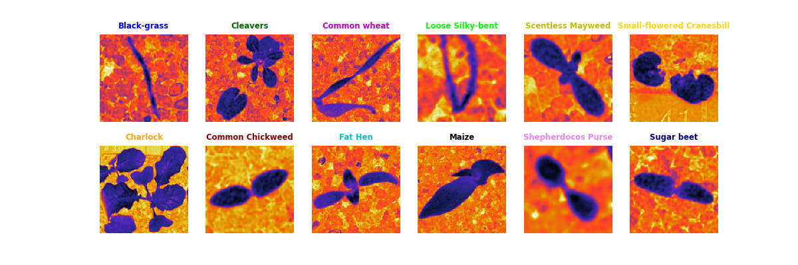

# <!-- TITLE --> Plant Seedlings Project
</img>

## Project description :

| __Noms d'espèces__                    | __Nombre de plantes par espèces__ |  total|
|---------------------------------------|----------------------------------|------|
| __Black-grass__                       | __309__               |
| __Charlock__                          | __452__               |
| __Cleavers__                          | __335__               |
| __Common Chickweed__                  | __713__               |
| __Common wheat__                      | __253__               |
| __Fat Hen__                           | __538__               |
| __Loose Silky-bent__                  | __762__               |
| __Maize__                             | __257__               |
| __Scentless Mayweed__                 | __607__               |
| __Shepherdoco Purse__                 | __274__               |
| __Small-flowered Cranesbill__         | __576__               |
| __Sugar beet__                        | __463__               | 
|                                       |                       | _```12 espèces```_|

- Data source : [Kaggle V2 Plant Seedlings Dataset](https://www.kaggle.com/datasets/vbookshelf/v2-plant-seedlings-dataset)

## Objectives : 

## Strategies:

## Methods :

## Acknowledgement :

## Authors : 
* __**```Dr. Iréné A.E```**__
* __**```Olivier M.```**__ 
* __**```Hassan Z.```**__
* __**```Gilles D.P```**__

## 🤝 Support 
Give a ⭐ if you like this project!

## License 
Copyrihght © 2023 __**Iréné A.E, Olivier M., Hassan Z., Gilles D.P**__

This project is licensed under [MIT License](https://github.com/amiehe-essomba/Plant_Seedlings_ds_Project/blob/Plant_Seedlings/LICENSE)
